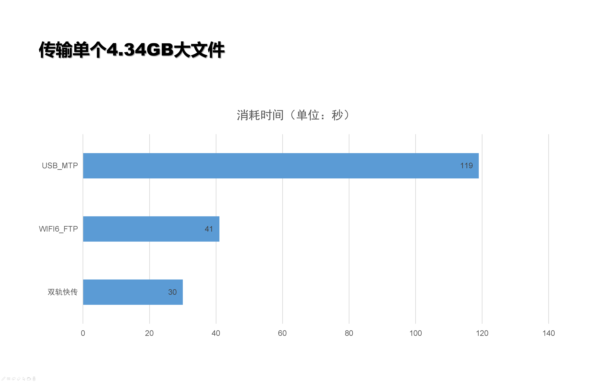
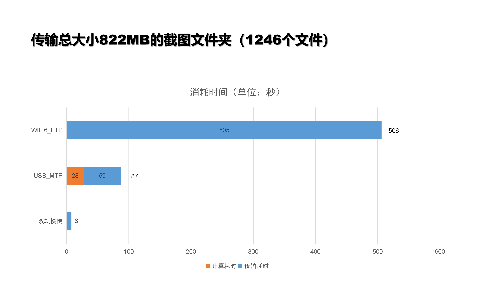
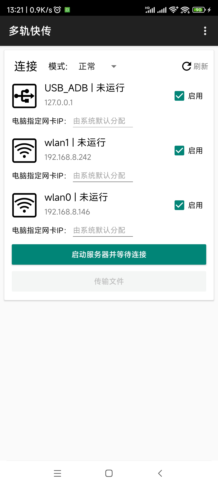
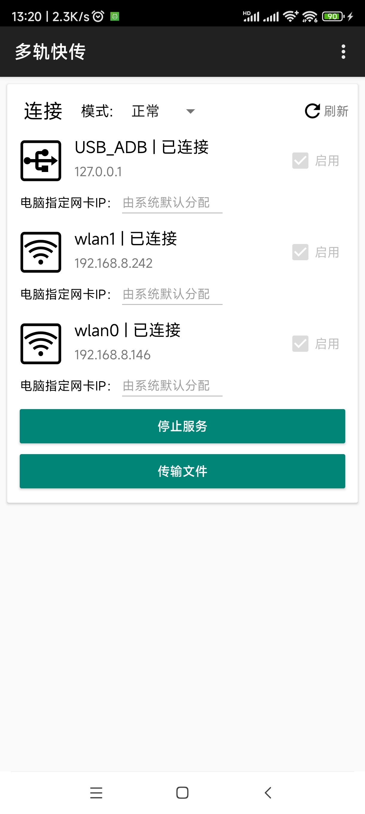
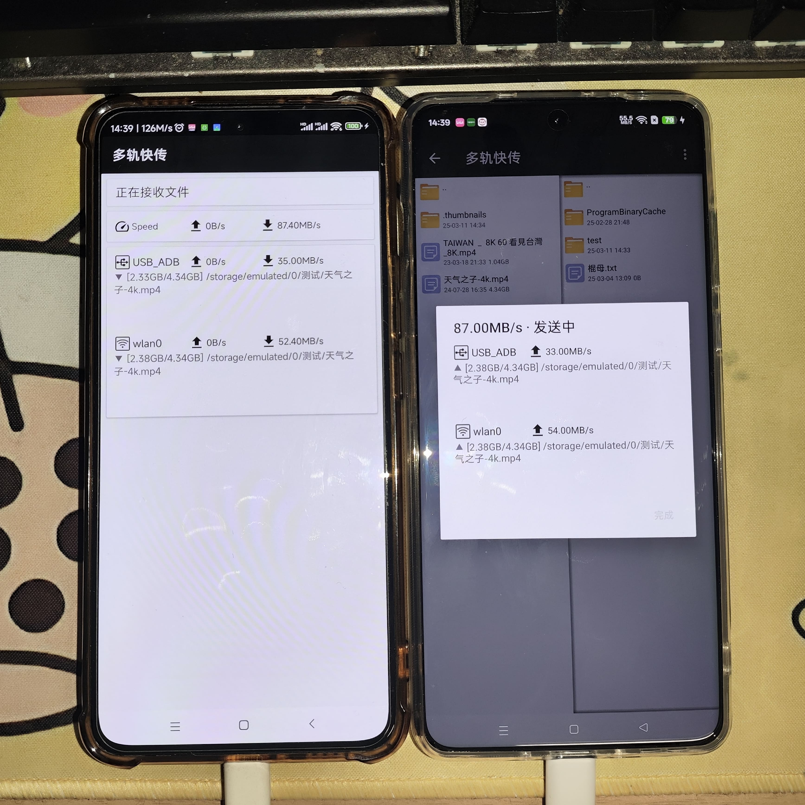
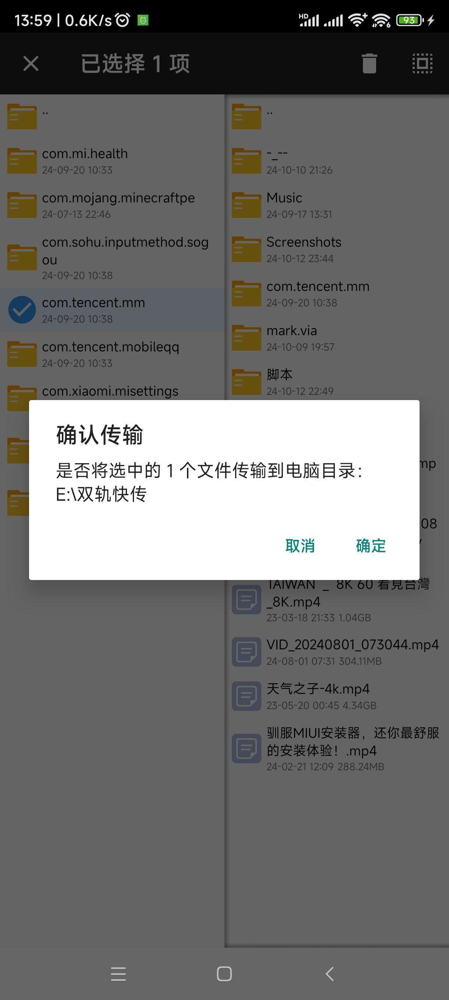
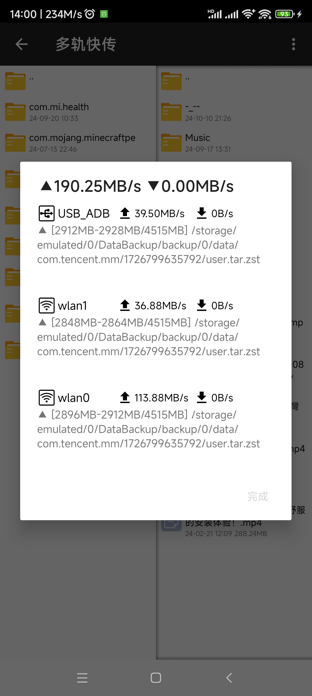
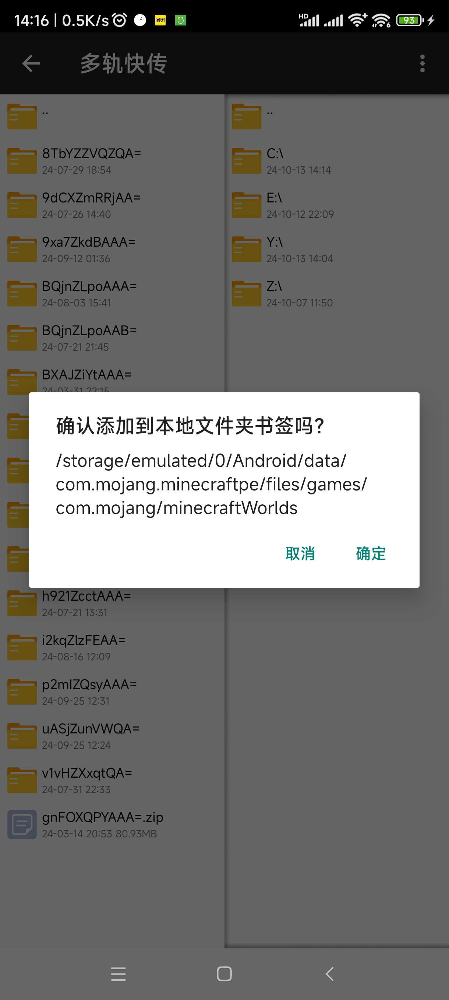
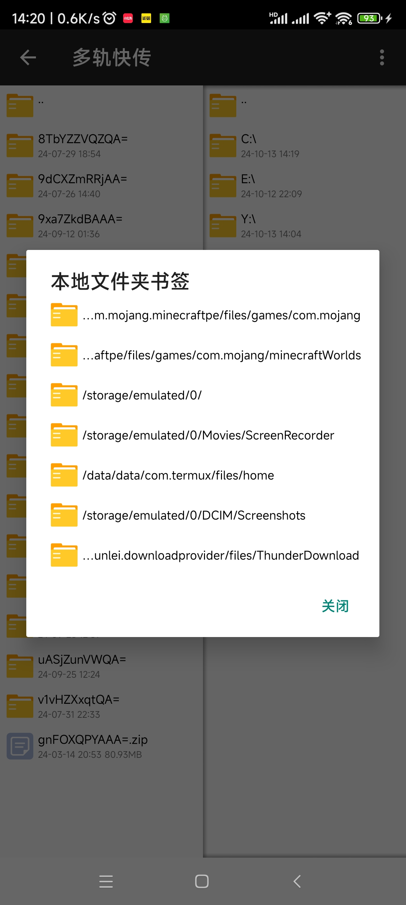
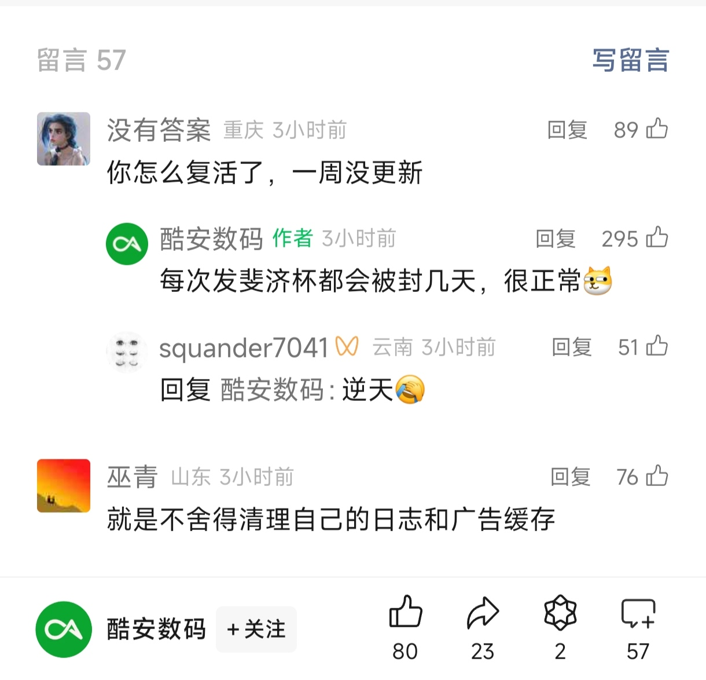

# 多轨快传
多轨快传（原双轨快传），一个可以同时使用USB和WIFI等多张网卡传输文件到电脑的软件。

用尽手机一切对外可用IO通道，提升传输速度。

USB2.0+WIFI6（千兆网口）可以跑到150MB/s（40+110MB/s）！

USB2.0+WIFI6_5G:160mhz+WIFI6_2.4G:40mhz 可以跑到200+MB/s！

## 速度测试（USB2.0+WIFI6:GbE）






# 使用

## 模式

IO服务的启动模式，可选正常、ROOT、ADB，依靠Shizuku启动。

ROOT可以访问data目录那些的，权限最高，ADB权限也稍微高那么点点，比如可以访问外置SD卡目录。

注意：`~/Android/data/`目录需要ROOT模式，ADB做不到。请不要指责我，感到不适请发邮件到谷歌安卓部那抗议！

## 网卡与通道

选择要用于传输的网卡，一个网卡一个通道。

只要能被识别为网卡的，都会显示在网卡列表中，比如这些

- 连接一个WIFI
- 连接双WLAN加速的辅助WIFI
- 打开热点
- USB网络共享
- 蓝牙网络共享（不建议用）
- 物理以太网口
- VPN软件的TUN网卡（请勿选择）
- ~~蜂窝网络~~（已过滤，若有需要请修改编译源码）

请选择**可以同电脑进行局域网传输**的网卡

USB_ADB的连接比较特殊，它是通过`adb forward tcp:<port> tcp:<port>`转发命令实现的，将手机的端口转发到本机（127.0.0.1）上，使其能够通过USB进行网络传输。

## 连接

### 手机端

插上数据线并连接WIFI，WIFI**需要与电脑处在同一局域网内**（推荐电脑使用网线直连路由器）

USB_ADB的连接需要USB调试，请到开发者选项中打开，**如果你因各种原因不能使用ADB，可以改用USB网络共享代替ADB。**

主界面选择好模式后点击按钮`启动服务器并等待连接`，状态显示“等待连接”后，电脑双击运行启动脚本`启动_ADB连接.bat`（或者你根据启动参数自己编写一个）。如果提示没有java，则需要[安装java运行环境](https://www.oracle.com/java/technologies/javase/jdk17-archive-downloads.html)，安装过程不过多阐述，与我的世界安装java环境过程一致。ADB连接方式下，程序首先执行adb转发端口（USB通道），若电脑未授权USB调试，请点击手机上的“允许这台电脑进行调试”。端口转发完成后，启动电脑客户端，客户端先连接控制通道，然后从控制通道获取手机指定的传输通道网卡信息，然后电脑客户端连接到这些传输通道网卡，选择的线路都连接成功后，『传输文件』按钮亮起即可进行文件传输。

|                        选择模式与网卡                        |                           电脑连接                           |
| :----------------------------------------------------------: | :----------------------------------------------------------: |
|  |  |

### 电脑客户端连接

通道分为控制通道与传输通道，控制通道用于通知对方发送或接收文件、列出文件夹、创建文件夹等，传输通道用于传输文件。

`-c` 参数指定的是控制通道的连接方式，为`adb`或IP地址，IP地址可填写任意一个手机的网卡IP。

**参数说明**

```
-c 控制通道连接方式 "adb" 或 网络ip
-s adb连接方式下指定的设备（adb有多设备的情况），你可以单独开个cmd窗口，用"adb devices"命令查看设备
-d 指定主目录，即手机上第一次展示的右侧对方目录
示例：
-c adb
-c adb -s abcd1234
-c adb -d C:\Users\Administrator\Desktop\
-c 192.168.1.2
```

**完整启动命令示例**

```
java -jar HybridFileXfer.jar -c adb
java -jar HybridFileXfer.jar -c adb -s abcd1234
java -jar HybridFileXfer.jar -c adb -d C:\Users\Administrator\Desktop\
java -jar HybridFileXfer.jar -c 192.168.1.2
```

**电脑输出**

```
adb:5740
USB_ADB : 5740 端口转发成功！
正在连接 网卡名：USB_ADB 远程地址：127.0.0.1 绑定地址：null
正在连接 网卡名：wlan1 远程地址：192.168.8.242 绑定地址：null
正在连接 网卡名：wlan0 远程地址：192.168.8.146 绑定地址：null
传输通道已全部连接完成
```

### 技巧

- 很多手机支持双WIFI加速，用上速度可以再增加！小米手机：WLAN => WLAN助理 => 智能多网加速 => 双WLAN加速，选择第二条不同频段的WIFI，可实现5Ghz+2.4Ghz加速！其他手机自行探索。**连上第二条WIFI后记得刷新下网卡列表**。

- 如果你没有路由器，但电脑有无线网卡，可以手机打开热点给电脑或反过来操作，即可建立电脑与手机之间的无线局域网，进行文件传输

- 如果5Ghz频段WIFI已可以跑满你电脑的千兆网口，你没有2.5G网口，如何通过双WLAN加速来提高传输速度？

  - 如果电脑还有一个无线网卡。电脑打开一个不同频段的热点，然后手机连接电脑的热点作为辅助WLAN。或者手机打开与已连接WIFI不同频段的热点（切勿相同频段，能打开成功但一定会干扰降速！），电脑连接手机开的热点。

  - 如果电脑有两个千兆网卡。方法一是网卡合并，效果最好但是难以操作。方法二：两条网线都插入路由器，此时两张网卡各自一个IP地址。手机开启双WLAN加速，连接两个频段的WIFI。返回软件，此时由于电脑两张网卡都连接着同一上级路由，若系统默认分配，可能双WLAN的流量都走同一张网卡！所以需要在手机上设置『电脑指定网卡IP』使这两条通道各自走独立的电脑网卡。各自填写上对应的电脑网卡IP即可。

## 其他设备

### Linux电脑

v1.1新增对Linux的支持，下载对应的电脑客户端即可，解压后执行对应命令，例如

```shell
java -jar HybridFileXfer.jar -c adb
```

目前仅支持x86 CPU的电脑，虽然Java是跨平台的，但是adb对处理器架构有要求。如果你需要在ARM，RISC-V，龙芯等CPU架构下运行，可以寻找对应处理器架构的adb程序，复制到jar包的同一目录。又或者使用USB网络共享。

### Mac电脑

个人没尝试在Mac电脑上运行，但Java跨平台，ADB也有对应Mac版，可自己折腾。

### 安卓手机

可在Termux里运行jar文件，具体教程自行搜索。

当然，不用这么麻烦，**本应用自带对传功能**。

主页右上角，『连接手机服务端』，请确保对方手机所勾选网卡IP可连上，可以是同一局域网WIFI或者是热点，控制器通道任选一个网卡IP即可。

**请注意**，不使用ADB转发请不要勾选网卡`USB_ADB`！

至于手机传手机如何利用USB通道？第一方案是OTG线或双头Type-c线，只不过有以下两个问题

- 若在手机端跑动USB连接的ADB，需要ROOT权限。
- 使用USB网络共享，安卓手机并不能使用

最终的解决方案是：将两台手机同时插到电脑上，用电脑进行转发。将服务端手机的端口用adb转发（forward）到电脑上，再将电脑上的端口用adb转发回（reverse）客户端手机。

两部手机插到电脑后，运行`USB-forward.bat`脚本（中文版本`USB-forward_中文.bat`），按照提示操作即可。

转发完毕后，即可勾选使用USB_ADB网卡。同时，控制通道也可以选择USB_ADB的本地地址127.0.0.1（不是必须的）



## 传输

连接成功后，点击传输文件按钮，即可开始选择文件进行传输。

UI是双排文件管理器（照搬的MT管理器）。左边文件列表是当前手机的文件列表，右边为电脑的文件列表。

点击文件夹进入子目录，按手机的返回键，返回当前焦点所在目录的上一级。

长按文件或文件夹，进入选择模式。选择完后，长按任意一个被选中的条目，点击确认对话框的确定即开始传输，选中的文件或文集夹将传输到另一侧的目录里。左往右是传输到电脑，反之就是传输电脑文件到手机。

例如：/sdcard/ > [/sdcard/test/] ==> E:\\transfer\\ > [E:/transfer/test/]

|                                                              |                                                              |
| ------------------------------------------------------------ | ------------------------------------------------------------ |
|  |  |


传输完毕后，点击右上角“←”退出文件列表，点击停止服务器以正常断开与电脑的连接。

## 关于进度条

计算进度是一件比较耗费时间的事情，尤其是遇到许多小文件的时候，计算会非常耗时。例如截图文件夹，计算所消耗的时间就占了总时间的1/3！参照fastcopy的存在。所以没有实现进度条。

## 书签

v1.2.0新增书签功能。

### 添加书签

点击右上角菜单，添加书签。有两个书签列表，一个是**手机**，一个是**电脑**。若当前焦点是本地文件夹，确认后书签将添加至本地文件夹书签列表，若当前焦点是电脑文件夹，确认后书签将添加至电脑文件夹书签列表。

### 跳转书签

点击右上角菜单，书签列表。点击要跳转的书签即可跳转至目标目录。

| 右上角菜单                                                   | 添加书签                                                     | 书签列表                                                     |
| ------------------------------------------------------------ | ------------------------------------------------------------ | ------------------------------------------------------------ |
|  |  |  |

*演示中的~/Android/data/……目录需要root访问（安卓11以上）*


# 原理

将文件传给对方，发送方有一个读文件线程和多个网络发送线程，接收方有一个写文件线程和多个网络接收线程。首先由文件读取线程将文件读取到1MB的文件块中，再将块存到队列里，接着继续读到取下一个块。与此同时有多个传输线程同时向队列里取文件分块，然后向网络发送。接收端这里，多个接收线程都有它自己的队列，将接收的文件块插入队尾，与此同时，文件写入线程，获取所有队列队头索引值最小的一个文件块，将其写入硬盘。由于所有队列中，文件块都遵循从小到大的顺序（这就比如你将一组从小到大的数字，按顺序取出，再放到不同的新数组中，这些新的数组里的数字都遵循从小到大的顺序），这样取出来的文件块，索引就是连续的。若网速比硬盘写入速度快时，写入是顺序的，提升机械硬盘这种设备的性能。若网速比硬盘写入速度慢时，由于一接收到块就立刻被写到硬盘里了，写入就是随机的。

具体请查看源码

# 魔法

禁止以任何形式在飞机杯社区（酷安）分享本软件，否则后果自负！




酷安斐济杯文章来源[https://mp.weixin.qq.com/s/gt8DiwC3kWmyzjLCze1TRg](https://mp.weixin.qq.com/s/gt8DiwC3kWmyzjLCze1TRg)

# 赞助

前赞助计划[2.5G-WIFI6 GL-MT6000 路由器](https://m.tb.cn/h.gcb0Q6flYgnOqrX?tk=ubRnWtrez83)，已通过大家的赞助+自己的费用购买到，谢谢大家的赞助！

喜欢本软件可以赞助支持！

请备注“赞助双轨快传-[你的github ID]”。所有赞助名单都将公布！

若你想匿名赞助，请填写备注`赞助双轨快传`但不备注你的信息，**否则我无法判断收款码收款意图！将不会纳入赞助名单！**

[查看赞助名单](./赞助名单.md)


## 许可证

本项目使用的JDK来源于 **Dragonwell JDK**，该部分代码受到 **GNU General Public License version 2 (GPL-2.0)**，并且附加 **Classpath Exception** 的保护。

**Dragonwell JDK** 的许可证原文请参见 [Dragonwell JDK License](https://github.com/dragonwell-project/dragonwell21/blob/master/LICENSE)。

本项目整体使用 **GNU General Public License version 3 (GPL-3.0)**，许可证文件可以在 [LICENSE](./LICENSE) 文件中找到。

### Dragonwell JDK License

**Dragonwell JDK** 的代码基于 **GPL-2.0** 发布，并附有 **Classpath Exception**。这些条款允许您将该库与其他独立的模块链接，以创建和分发符合其他许可证要求的可执行文件。

特别说明：
- 如果你将本项目进行分发，务必保留 **Dragonwell JDK** 的版权声明和许可证原文。
- 本项目中的其他部分基于 **GPL-3.0**，这意味着任何对本项目的修改和分发必须符合 GPL-3.0 的条款。

## 声明

任何人都可自由提交PR，只要你的代码对该项目有帮助！

欢迎会编写程序的你提交代码为此项目做贡献，而不是只会在Issues里提一些稀奇古怪的建议。

PR列表个人头像表达含义属于他们的自由。与本项目主无关！

